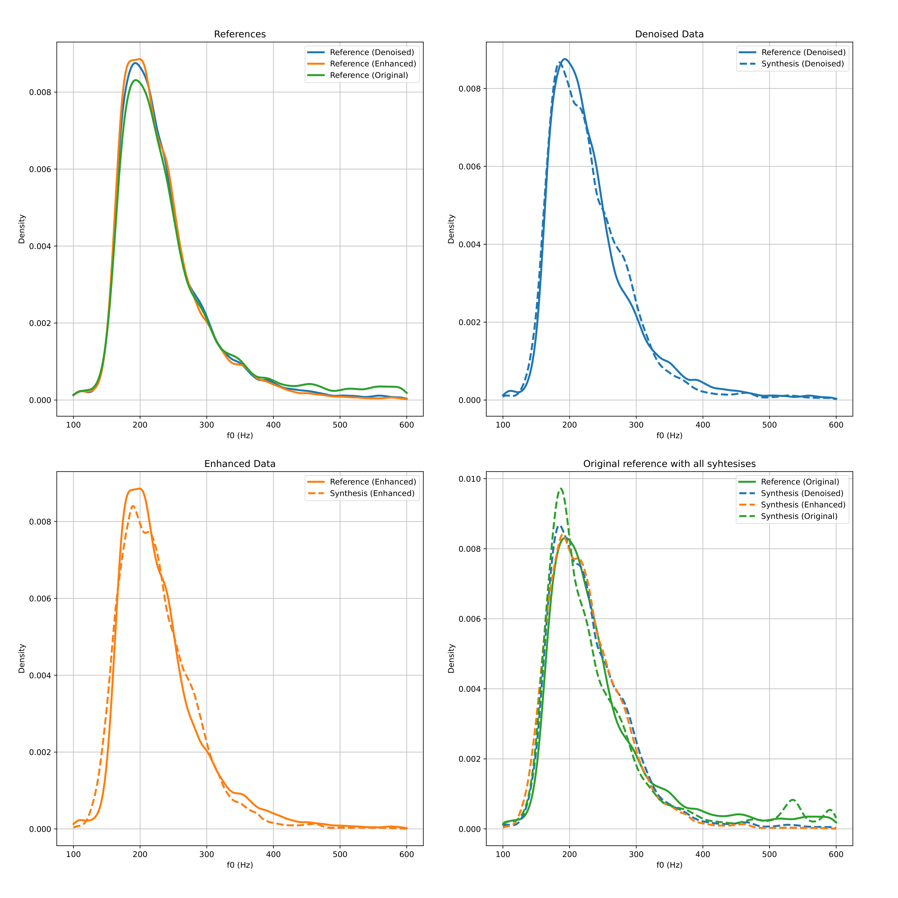
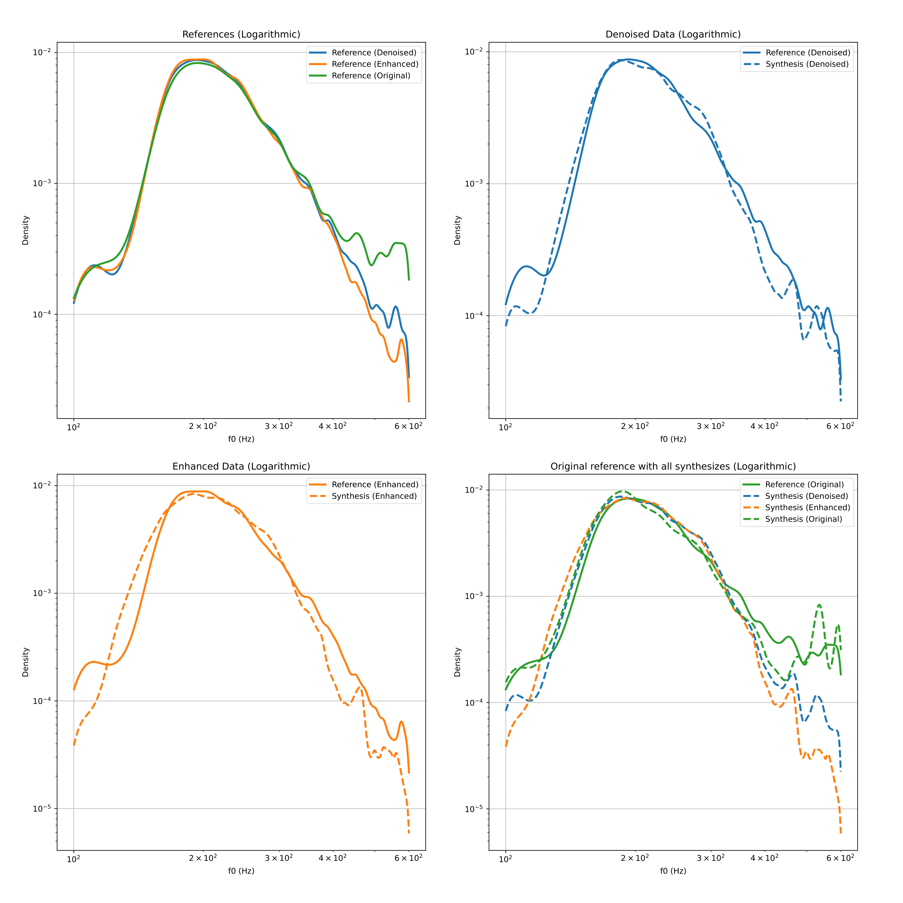
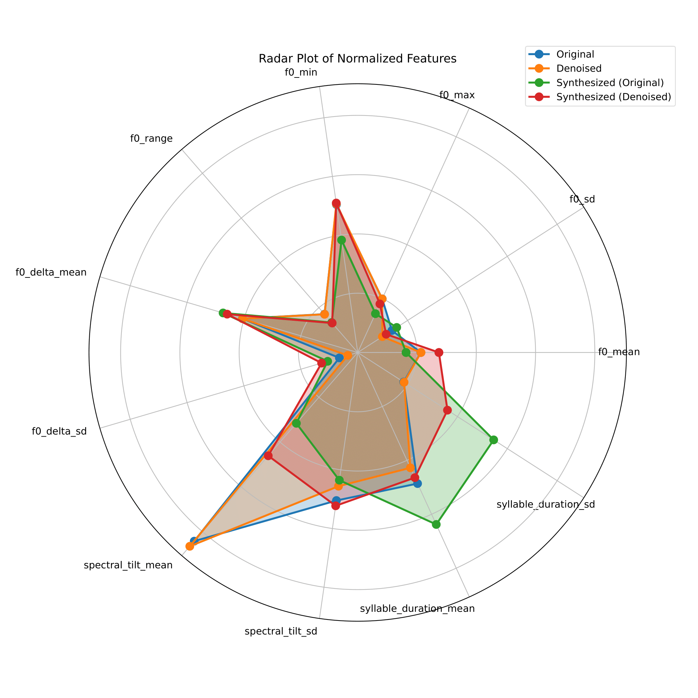

# IDS-Synthesis-with-XTTS
Analyzing the IDS (Infant-Directed Speech) synthesizing capabilities of a TTS model

## Installation:
### Start here

1. Clone the repository and install [thetaOscillator](https://github.com/orasanen/thetaOscillator/blob/master) into the "thetaOscillator" folder and follow the instructions provided there for installation. The MATLAB version was used here. The environment variable does not contain TTS.
2. Matlabengine is required to one function to use [thetaOscillator](https://github.com/orasanen/thetaOscillator/blob/master), and that should be installed according to [MATLAB Engine for Python Installation Instructions](https://www.mathworks.com/help/matlab/matlab_external/install-the-matlab-engine-for-python.html). Other options would be to modify 'get_syllable_duration_statistics' function to work without this or simply load precalculated values.

### ONLY EXTRACT DATA ->

1. From the provided .zip file, extract the contents of the references into the "references" folder, synthesised audio into the "synthesised" folder, and texts into the "texts" folder under "synthesis_stage".
2. Run `statistics.py`
3. Run `display.py`

### Synthesize with the SAME references as I ->

1. From the provided .zip file, extract the contents of the references into the "references" folder and texts into the "texts" folder under "synthesis_stage".
2. Install [Coqui TTS](https://github.com/coqui-ai/TTS) by following their installation instructions. The "XTTS" folder can be used to store the model(s).
3. Run `synthesizer.py`
4. Run `statistics.py`
5. Run `display.py`

### Synthesize with DIFFERENT references as I ->

1. Extract your references into the "original" folder under "synthesis_stage/references" and texts into the "texts" folder under "synthesis_stage".
2. Install [Coqui TTS](https://github.com/coqui-ai/TTS) by following their installation instructions. The "XTTS" folder can be used to store the model(s).
3. Run `synthesizer.py`
4. ????

## Project Description

The project aims to use an XTTS model to synthesize Infant-Directed Speech (IDS) from IDS references, even though the model was not specifically designed for this purpose. Due to the poor quality of the IDS references, the model from [Resemble AI](https://github.com/resemble-ai/resemble-enhance) was employed to clean up the audio using the "denoise" and "enhance" functionalities.

Subsequently, prosodic and quality features were extracted from both the synthesized and reference audio. The extracted statistics were then visualized using various types of figures, including scatter plots with ellipse fitting to mean and standard deviation, Kernel Density Estimates (KDEs) from density functions, and radar plots summarizing all statistics together. Comparisons were made between the original IDS reference and the syntheses of all original, denoised, and enhanced versions.

## Examples

[Resemble AI](https://github.com/resemble-ai/resemble-enhance) for denoise and enhanced. [Example audio source](https://www.youtube.com/watch?v=F9qS_AZCdgM)

## References:

- **Original IDS:**

https://github.com/user-attachments/assets/4cb94a65-e767-4b6b-8b07-b9796e1be336

- **Enhanced IDS:**
  <video width="320" height="240" controls>
    <source src="https://github.com/your-username/your-repo/raw/main/examples/IDS_example_enhanced.mp4" type="video/mp4">
    Your browser does not support the video tag.
  </video>

- **Denoised IDS:**
  <video width="320" height="240" controls>
    <source src="https://github.com/your-username/your-repo/raw/main/examples/IDS_example_denoised.mp4" type="video/mp4">
    Your browser does not support the video tag.
  </video>

## Syntheses:

- **Original IDS:**
  <video width="320" height="240" controls>
    <source src="https://github.com/your-username/your-repo/raw/main/examples/xtts_IDS_example_original_GILES_1.mp4" type="video/mp4">
    Your browser does not support the video tag.
  </video>

- **Enhanced IDS:**
  <video width="320" height="240" controls>
    <source src="https://github.com/your-username/your-repo/raw/main/examples/xtts_IDS_example_enhanced_GILES_1.mp4" type="video/mp4">
    Your browser does not support the video tag.
  </video>

- **Denoised IDS:**
  <video width="320" height="240" controls>
    <source src="https://github.com/your-username/your-repo/raw/main/examples/xtts_IDS_example_denoised_GILES_1.mp4" type="video/mp4">
    Your browser does not support the video tag.
  </video>

### Figures

- **Scatter Plot:**
  

- **KDE of Density:**
  

- **Logarithmic KDE:**
  

- **Radar Plot:**
  
